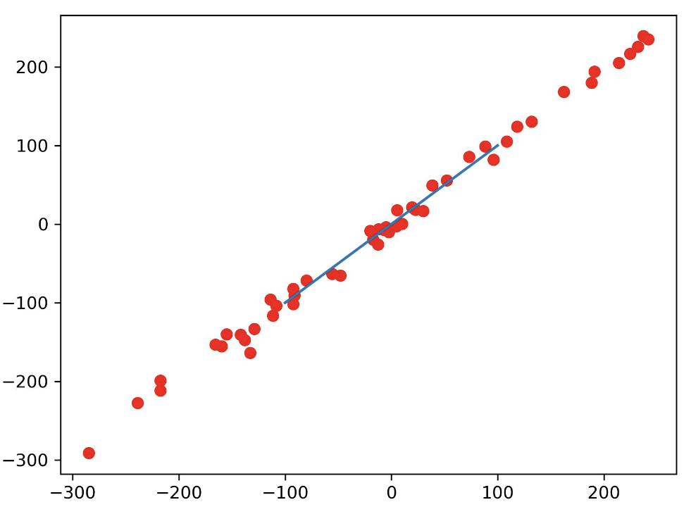
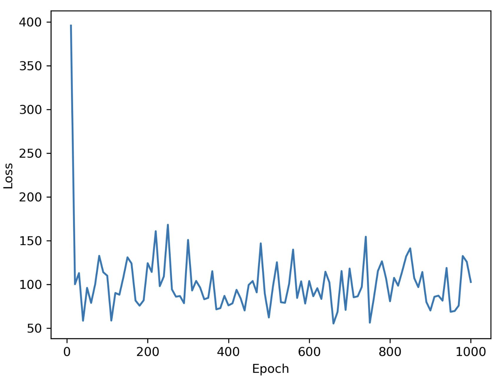

<!--
 * @Descripttion: 
 * @version: 
 * @Author: sch
 * @Date: 2022-03-17 15:41:44
 * @LastEditors: sch
 * @LastEditTime: 2022-03-18 08:56:01
-->
# 1. 数据产生
```python
import pandas as pd
from sklearn.datasets import make_regression
from sklearn.model_selection import train_test_split


trainset_path = "/data/home/liuhanyu/Interaction/torch_test/data/input/train.csv"
testset_path = "/data/home/liuhanyu/Interaction/torch_test/data/input/test.csv"

# 产生数据
X_numpy, y_numpy = make_regression(n_samples=1000,
                                    n_features=3,
                                    noise=10,
                                    random_state=0
                                    )
df_X = pd.DataFrame(X_numpy, columns=[0, 1, 2])
df_y = pd.DataFrame(y_numpy, columns=[3])


# 划分训练集、测试集
X_train, X_test, y_train, y_test = train_test_split(df_X, df_y,
                                                    test_size=0.2,
                                                    random_state=0
                                                    )
df_train = pd.concat([X_train, y_train], axis=1)
df_test = pd.concat([X_test, y_test], axis=1)

# 分别保存训练集和测试集
df_train.to_csv(trainset_path, index=False)
df_test.to_csv(testset_path, index=False)
```
Output:
```shell
$ ls /data/home/liuhanyu/Interaction/torch_test/data/input
test.csv  train.csv  wine.csv
```


# 2. `Dataset` class
<font color="red" size="4">

Note
----
1. 分别加载`训练集`和`测试集`

</font>

```python
import numpy as np
import pandas as pd
import torch.nn as nn
from torch.utils.data import Dataset, DataLoader


class NewDataset(Dataset):
    def __init__(self, csv_path:str):
        df = pd.read_csv(csv_path)
        X_numpy = df.iloc[:, :3].values
        y_numpy = df.iloc[:, [3]].values
        
        self.X = torch.from_numpy(X_numpy.astype(np.float32))
        self.y = torch.from_numpy(y_numpy.astype(np.float32))
        self.y = self.y.view(-1, 1)
        
        self.n_samples, self.n_features = self.X.size()
    
    
    def __getitem__(self, index):
        return self.X[index], self.y[index]

    
    def __len__(self):
        return self.n_samples


if __name__ == "__main__":
    train_csv_path = "/data/home/liuhanyu/Interaction/torch_test/data/input/train.csv"
    test_csv_path = "/data/home/liuhanyu/Interaction/torch_test/data/input/test.csv"
    
    # 1. Data Preparation
    trainset = NewDataset(csv_path=train_csv_path)
    testset = NewDataset(csv_path=test_csv_path)
```

# 3. `Dataset` code && `Model` code && `Train Loop` code
```python
import torch 
import numpy as np
import pandas as pd
import torch.nn as nn
import matplotlib.pyplot as plt
from torch.utils.data import Dataset, DataLoader


class NewDataset(Dataset):
    def __init__(self, csv_path:str):
        df = pd.read_csv(csv_path, header=0)    # 选择第 0 行为 header
        X_numpy = df.iloc[:, :3].values
        y_numpy = df.iloc[:, [3]].values
        
        self.X = torch.from_numpy(X_numpy.astype(np.float32))
        self.y = torch.from_numpy(y_numpy.astype(np.float32))
        self.y = self.y.view(-1, 1)
        
        self.n_samples, self.n_features = self.X.size()
    
    
    def __getitem__(self, index):
        return self.X[index], self.y[index]

    
    def __len__(self):
        return self.n_samples
    
    

class Model(nn.Module):
    def __init__(self,
                dim_input:int,
                dims_hidden:list,
                dim_output:int,
                ):
        super(Model, self).__init__()
        
        self.fcs = []
        self.activation = nn.ReLU()
        
        dims_hidden = [dim_input] + dims_hidden
        
        for idx in range(1, len(dims_hidden)):
            fc = nn.Linear(dims_hidden[idx-1], dims_hidden[idx])
            self._init_fc(fc)
            setattr(self, "fc{}".format(idx), fc)
            self.fcs.append(fc)
        
        self.output_layer = nn.Linear(dims_hidden[-1], dim_output)
        self._init_fc(self.output_layer)
    
    
    def _init_fc(self, fc):
        nn.init.normal_(fc.weight, mean=0, std=0.1)
        nn.init.constant_(fc.bias, 0)
    
    
    def forward(self, x):
        for idx in range(len(self.fcs)):
            x = self.fcs[idx](x)
            x = self.activation(x)
        
        x = self.output_layer(x)
        
        return x

    

if __name__ == "__main__":
    train_csv_path = "/data/home/liuhanyu/Interaction/torch_test/data/input/train.csv"
    test_csv_path = "/data/home/liuhanyu/Interaction/torch_test/data/input/test.csv"
    Epoch_Loss_path = "/data/home/liuhanyu/Interaction/torch_test/data/output/Epoch_Loss"
    pic_path = "/data/home/liuhanyu/Interaction/torch_test/data/output/pic.jpg"
    model_path = "/data/home/liuhanyu/Interaction/torch_test/data/output/model.pkl"
    
    dim_input = 3
    dims_hidden = [10, 15, 10]
    dim_output = 1
    
    # 1. Data Preparation
    trainset = NewDataset(csv_path=train_csv_path)
    testset = NewDataset(csv_path=test_csv_path)
    trainloader = DataLoader(dataset=trainset,
                            batch_size=50,
                            shuffle=True
                            )
    # 2. Model
    model = Model(dim_input, dims_hidden, dim_output)
    
    # 3. Loss function && optimizer
    loss_function = nn.MSELoss()
    optimizer = torch.optim.Adam(
                            model.parameters(),
                            lr=1e-2,
                            weight_decay=1e-5
                            )
    
    # 4. Train Loop
    num_epochs = 1000
    
    # 进入训练模式
    model.train()
    for epoch in range(1, num_epochs+1):
        for idx, (X, y) in enumerate(trainloader):
            ## 4.1. Forward
            y_pred = model(X)
            loss = loss_function(y_pred, y)
            
            ## 4.2. Backward
            loss.backward()
            
            ## 4.3. Update
            optimizer.step()
            optimizer.zero_grad()
    
        if (epoch % 10 == 0):
            with open(Epoch_Loss_path, "a") as f:
                f.write("{0},{1}\n".format(epoch, loss))
            torch.save(model, model_path)
            
# 进入预测模式
model.eval()
with torch.no_grad():
    y_pred = model(X).numpy().ravel()
    plt.scatter(y, y_pred, color="red")
    plt.plot([-100, 100], [-100, 100])
    plt.savefig(pic_path, dpi=300)
```
Output:


```python
import pandas as pd
import matplotlib.pyplot as plt

pic_path = "/data/home/liuhanyu/Interaction/torch_test/data/output/epoch_loss.jpg"
# 0. Data Preparation
df = pd.read_csv("/data/home/liuhanyu/Interaction/torch_test/data/output/Epoch_Loss", header=None)

# 1. plot
plt.plot(df.iloc[:, 0], df.iloc[:, 1])
plt.xlabel("Epoch")
plt.ylabel("Loss")
plt.savefig(pic_path, dpi=300)
```
Output:



# S1. 多层神经网络的构造 (原版)
<font color="gree" size="4">

1. 全连接层：init weight and bias
2. Batch Normalization
3. Activation
4. Dropout: `model.train()` 和 `model.eval()`

</font>

```python
import torch
import torch.nn as nn
import numpy as np
import matplotlib.pyplot as plt
from sklearn import datasets
from sklearn.preprocessing import StandardScaler
from sklearn.model_selection import train_test_split


# 0) Data preparation
X_numpy, y_numpy = datasets.make_regression(n_samples=1000, n_features=30,
                                            noise=20, random_state=0)
X_train, X_test, y_train, y_test = train_test_split(X_numpy, y_numpy, 
                                                    test_size=0.2, random_state=0)                                        

sc = StandardScaler()
X_train = sc.fit_transform(X_train)
X_test = sc.fit_transform(X_test)

X_train = torch.from_numpy(X_train).float()
X_test = torch.from_numpy(X_test).float()
y_train = torch.from_numpy(y_train).float()
y_test = torch.from_numpy(y_test).float()
X_train.requires_grad_()
y_train = y_train.view(-1, 1)
y_test = y_test.view(-1, 1)

n_samples, n_features = X_numpy.shape


# 1) model
class NNModel(nn.Module):
    
    DP_RATIO = 0.3

    def __init__(self, input_dim:int, hidden_dims_lst:list, output_dim:int,
                do_bn:bool, do_dp:bool):
        super(NNModel, self).__init__()

        self.do_dp = do_dp
        self.do_bn = do_bn
        self.activation = nn.ReLU()

        self.fcs, self.dps, self.bns = [], [], []
        hidden_dims_lst = [input_dim] + hidden_dims_lst
        
        self.bn_input = nn.BatchNorm1d(input_dim)

        for idx in range(1, len(hidden_dims_lst)):
            fc = nn.Linear(hidden_dims_lst[idx-1], hidden_dims_lst[idx])
            self._init_fc(fc)
            setattr(self, "fc{0}".format(idx), fc)
            self.fcs.append(fc)

            if do_bn:
                bn = nn.BatchNorm1d(hidden_dims_lst[idx])
                setattr(self, "bn{0}".format(idx), bn)
                self.bns.append(bn)
            
            if do_dp:
                dp = nn.Dropout(self.DP_RATIO)
                setattr(self, "dp{0}".format(idx), dp)
                self.dps.append(dp)
        
        self.output_layer = nn.Linear(hidden_dims_lst[-1], output_dim)
        self._init_fc(self.output_layer)
    

    def _init_fc(self, fc):
        nn.init.normal_(fc.weight, mean=0, std=0.1)
        nn.init.constant_(fc.bias, 0)


    def forward(self, x):
        x = self.bn_input(x)

        for idx in range(len(self.fcs)):
            x = self.fcs[idx](x)

            if self.do_bn:
                x = self.bns[idx](x)
            
            x = self.activation(x)

            if self.do_dp:
                x = self.dps[idx](x)

        x = self.output_layer(x)
        
        return x


model = NNModel(n_features, [30, 10], 1, do_bn=True, do_dp=True)


# 2) loss and optimizer
learning_rate = 0.01
criterion = nn.MSELoss()
optimizer = torch.optim.RMSprop(model.parameters(), lr=learning_rate,
                            weight_decay=0.001)


# 3) Training loop
num_epochs = 2000
model.train()
loss_train_lst = []
loss_test_lst = []

for epoch in range(num_epochs):
    # forward
    y_pred = model(X_train)
    loss = criterion(y_pred, y_train)
    loss_train_lst.append(loss)

    y_pred_test = model(X_test)
    loss_test = criterion(y_pred_test, y_test)
    loss_test_lst.append(loss_test)

    # backward
    loss.backward()

    # update weights
    optimizer.step()

    # make gradient zero
    optimizer.zero_grad()


    if ( (epoch+1) % 100 == 0 ):
        print("Epoch {0}: loss = {1}".format(epoch+1, loss))


with torch.no_grad():
    model.eval()

    y_pred = model(X_train)
    plt.plot(y_pred, y_train, "bo")
    plt.show()

    y_pred = model(X_test)
    plt.plot(y_pred, y_test, "ro")
    plt.show()

    plt.plot([*range(len(loss_train_lst))], loss_train_lst)
    plt.show()
    plt.plot([*range(len(loss_test_lst))], loss_test_lst)
    plt.show()
```