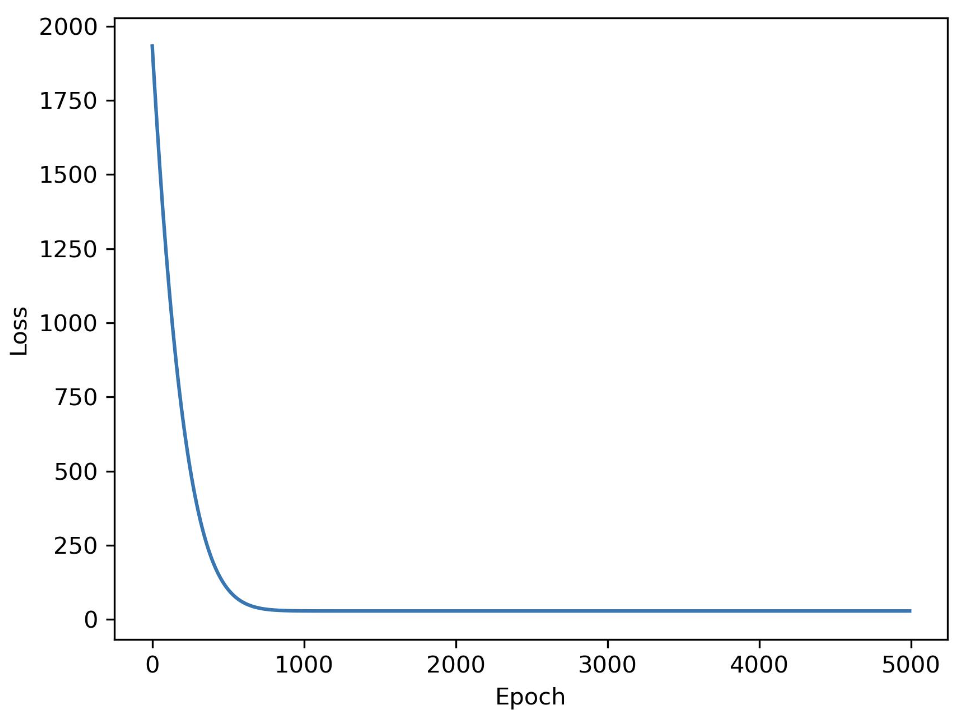

# Pipeline

<font color="orange" size="4">

1. Design model ( input, output size, forward pass )
2. Construct `loss` and `optimizer`
3. Training loop
      - `forward pass`: compute the prediction
      - `backward pass`: gradients 
      - `updates weights`

</font>


# 1. Linear Regression Demo
<font color="red" size="4">

Note
----
1. `torch.view(-1, 1)`: For `y`(the target we want to predict), We want put each value in one row, and the whole shape has only one column.
2. `predicted = model(X).detach().numpy()`: 当 `torch.tensor -> np.ndarray` 时，prevent this operation from being tracked in our graph and computational graph

</font>

## 1.1. Demo 1
```python
import torch
import torch.nn as nn
import numpy as np
from sklearn import datasets
import matplotlib.pyplot as plt

# 0) prepare data
X_numpy, y_numpy = datasets.make_regression(n_samples=100, n_features=1, noise=20, random_state=0)

X = torch.from_numpy(X_numpy.astype(np.float32))
y = torch.from_numpy(y_numpy.astype(np.float32)) 
# We want to put each value in one row, and the whole shape has only one column.
y = y.view(y.size()[0], 1)

n_samples, n_features = X.size()


# 1) model
input_size = n_features
output_size = 1
model = nn.Linear(input_size, output_size)

# 2) loss and optimizer
learning_rate = 0.01
criterion = nn.MSELoss()
optimizer = torch.optim.SGD(model.parameters(), lr=learning_rate)

# 3) training loop
num_epochs = 100
for epoch in range(1, num_epochs+1):
    # forward pass and loss
    y_pred = model(X)
    loss = criterion(y_pred, y)

    # back pass
    loss.backward()

    # update
    optimizer.step()

    # make gradient zeros
    optimizer.zero_grad()

    if ( epoch % 10 == 0 ):
        [w, b] = model.parameters()
        print("Epoch {0}: weights = {1}, loss = {2}".format(epoch, w[0][0], loss))

# plot
# prevent this operation from being tracked in our graph and computational graph
predicted = model(X).detach().numpy()
plt.plot(X_numpy, y_numpy, 'ro')
plt.plot(X_numpy, predicted, 'b')
plt.show()

```


## 1.2. Demo 2: <font color="red">需反复琢磨</font>
### 1.2.1. Model code
```python
import torch 
import torch.nn as nn
import numpy as np
from sklearn.datasets import make_regression
import matplotlib.pyplot as plt


model_path = "/data/home/liuhanyu/Interaction/torch_test/data/model.pkl"
pic_path = "/data/home/liuhanyu/Interaction/torch_test/data/pic.jpg"
Epoch_Loss_path = "/data/home/liuhanyu/Interaction/torch_test/data/Epoch_Loss"

# 0. data 
X_numpy, y_numpy = make_regression(
                            n_samples=100,
                            n_features=1,
                            noise=5,
                            random_state=0
                            )
X = torch.from_numpy(X_numpy.astype(np.float32))
y = torch.from_numpy(y_numpy.astype(np.float32))
y = y.view(-1, 1)
n_samples, n_features = X.shape


# 1. Model
class Model(nn.Module):
    def __init__(self, dim_input, dim_output):
        super(Model, self).__init__()
        setattr(self, "fc1", nn.Linear(dim_input, dim_output))
    
    def forward(self, x):
        res = self.fc1(x)
        return res
    
model = Model(dim_input=n_features, dim_output=1)


# 2. Loss function && Optimizer
loss_function = nn.MSELoss()
optimizer = torch.optim.Adam(
                    model.parameters(),
                    lr=1e-1,
                    weight_decay=1e-8
                    )


# 3. Train Loop
num_epochs = 5000

for epoch in range(num_epochs):
    # 3.1. Forward
    y_pred = model(X)
    loss = loss_function(y_pred, y)
    
    ## 3.2. backward -- gradient
    loss.backward()
    
    ## 3.3. Update 
    optimizer.step()
    optimizer.zero_grad()

    ## 3.4. Save the model
    if (epoch % 10 == 0):
        with open(Epoch_Loss_path, "a") as f:
            f.write("{0},{1}\n".format(epoch, loss))
        
        torch.save(model, model_path)

with torch.no_grad():
    y_pred = model(X).numpy().ravel()
    plt.scatter(y, y_pred, color="red")
    plt.plot([-100, 100], [-100, 100])
    plt.savefig(pic_path, dpi=300)
```

### 1.2.2. Output of `model code`
```shell
### `Epoch_Loss` file
0,1933.0955810546875
10,1844.7650146484375
20,1760.344970703125
30,1678.458740234375
40,1599.3282470703125
50,1523.0240478515625
60,1449.5057373046875
70,1378.747314453125
...
...
4960,28.54287338256836
4970,28.54287338256836
4980,28.54287338256836
4990,28.54287338256836
```

### 1.2.3. Plot `Epoch_Loss`
```python
import pandas as pd
import matplotlib.pyplot as plt

pic_path = "/data/home/liuhanyu/Interaction/torch_test/data/epoch_loss.jpg"
# 0. Data Preparation
df = pd.read_csv("/data/home/liuhanyu/Interaction/torch_test/data/Epoch_Loss", header=None)

# 1. plot
plt.plot(df.iloc[:, 0], df.iloc[:, 1])
plt.xlabel("Epoch")
plt.ylabel("Loss")
plt.savefig(pic_path, dpi=300)
```
Output：
