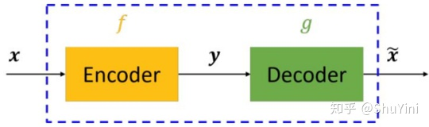
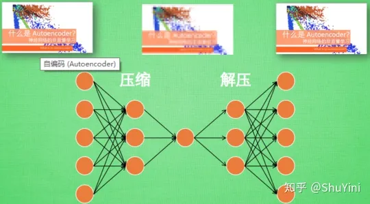
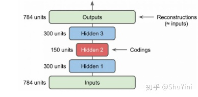

# 0. AutoEncoder

Website
-------
1. 简单文字介绍：https://zhuanlan.zhihu.com/p/80377698
2. 简单实现：https://www.geeksforgeeks.org/implementing-an-autoencoder-in-pytorch/

# 1. 自编码简单模型介绍

1. `自编码器`: 一个试图`还原其原始输入`的系统。自编码器模型如下图所示:

2. 从上图可以看出，自编码模型主要由`编码器(Encoder)`和`解码器(Decoder)`组成，其主要目的是将`输入x`准换成`中间变量y`，再将`中间变量y`转换成`输出x'`。使得`输入x`和`输出x'`无限接近。

# 2. 神经网络自编码模型

1. 在深度学习中，自动编码器是一种`无监督的神经网络模型`，它可以学习到`输入数据的隐含特征`，这称为`编码 (coding)`。
2. 同时，用学习到的新特征可以`重构出原始输入数据`，称之为`解码`。
3. 直观上来看，自动编码器可以用于`特征降维`，类似于`主成分分析 PCA`。但相比于PCA，其性能更强，这是由于神经网络模型可以提取更有效的新特征。
4. 除了进行`特征降维`，自动编码器学习到的新特征可以送入有监督学习模型中，所以自动编码器可以起到`特征提取器`的作用。
5. 举个例子，我有一张清晰图片，首先我通过编码器`压缩`这张图片的大小（如果展现出来可能比较模型），然后在需要解码的时候将其`还原`成清晰的图片。

6. 那么此时可能会有人问了，好端端的图片为什么要压缩呢?其主要原因是：有时神经网络要接受大量的输入信息, 比如输入信息是高清图片时, 输入信息量可能达到上千万, 让神经网络直接从上千万个信息源中学习是一件很吃力的工作. 所以, 何不压缩一下, `提取出原图片中的最具代表性的信息`, 缩减输入信息量, 再把缩减过后的信息放进神经网络学习. 这样学习起来就简单轻松了. 所以, 自编码就能在这时发挥作用. 
    - 通过将原数据白色的X 压缩, 解压 成黑色的X, 然后通过对比黑白 X ,求出预测误差, 进行反向传递, 逐步提升自编码的准确性. 
    - 训练好的自编码中间这一部分就是能总结原数据的精髓. 
    - 可以看出, 从头到尾, 我们只用到了输入数据 X, 并没有用到 X 对应的数据标签, 所以也可以说`自编码`是一种`非监督学习`. 
    - 到了真正使用自编码的时候. `通常只会用到自编码前半部分`。

## 2.1. 神经网络自编码器的三大特点

1. 自编码器是`数据相关的`。这意味着`自动编码器只能压缩那些与训练数据类似的数据`。
    - 比如，使用人脸训练出来的自动编码器在压缩别的图片，比如树木时性能很差，因为它学习到的特征是与人脸相关的。
2. 自动编码器是`有损的`，意思是解压缩的输出与原来的输入相比是退化的，MP3，JPEG等压缩算法也是如此。这与无损压缩算法不同。
3. 自动编码器是`从数据样本中自动学习的`，这意味着很容易对指定类的输入训练出一种特定的编码器，而不需要完成任何新工作。

## 2.2. 自编码器的 (Autoencoder) 搭建

1. 搭建一个自动编码器需要完成三样工作:
    1. 搭建 `Encoder`
    2. 搭建 `Decoder`
    3. 设定一个`损失函数`，用以衡量由于压缩而损失掉的信息
2. 编码器和解码器一般都是参数化的方程，并`关于损失函数可导`，`典型情况是使用神经网络`。
3. 根据上面介绍，`自动编码器`看作由`两个级联网络`组成:
    1. 第一个网络是一个`编码器`，负责`接收输入` $x$，并将输入通过`函数` $h(x)$ 变换为信号 $y$： $$y=h(x)$$
    2. 第二个网络将编码的信号 $y$ 作为其输入，通过`函数` $f(x)$ 得到重构的信号 $r$：$$r=f(y)=f(h(x))$$
    3. 定义`误差` $e$ 为`原始输入 $x$ 与`重构信号` $r$ 之差，$e=x–r$，网络训练的目标是减少均方误差（MSE），同 MLP 一样，误差被反向传播回隐藏层。

## 2.3. 几种常见编码器

1. `自编码器 (autoencoder)`: 经过训练后能尝试`将输入复制到输出`。
    - `自编码器（autoencoder）`内部有一个隐藏层 h，可以`产生编码（code）`表示输入。
    - 该网络可以看作由两部分组成：一个由函数 $h = f(x)$ 表示的`编码器`和一个生成重构的`解码器` $r = g(h)$。
    - 如果一个自编码器只是简单地学会将处处设置为 $g(f(x)) = x$，那么这个自编码器就没什么特别的用处。
    - 相反，我们`不应该将自编码器设计成输入到输出完全相等`。这通常需要向自编码器`强加一些约束`，使它只能近似地复制，并只能复制与训练数据相似的输入。这些约束强制模型考虑输入数据的哪些部分需要被优先复制，因此它往往能学习到数据的有用特性。
2. `堆栈自动编码器`: 前面讲的自编码器只是简答的含有一层，其实`可以采用更深层的架构`，这就是`堆栈自动编码器`或者`深度自动编码器`，本质上就是增加中间特征层数。这里我们以MNIST数据为例来说明自动编码器，`建立两个隐含层的自动编码器`，如下图所示：
    - 对于MNIST来说，其输入是 `28*28=784` 维度的特征，这里使用了两个隐含层其维度分别为 `300`和 `150`，可以看到是`不断降低特征的维度了`。得到的最终编码为 `150维度的特征`，使用这个特征进行反向重构得到重建的特征，我们希望重建特征和原始特征尽量相同。

3. `欠完备自编码器`: 从自编码器获得有用特征的一种方法是限制 $h$ 的维度比 $x$ 小，这种编码维度小于输入维度的自编码器称为`欠完备（undercomplete）自编码器`。学习欠完备的表示将强制自编码器`捕捉训练数据中最显著的特征`。
4. `正则自编码器`: 使用的损失函数可以鼓励模型学习其他特性（除了将输入复制到输出），而不必限制使用浅层的编码器和解码器以及小的编码维数来限制模型的容量。这些特性包括稀疏表示、表示的小导数、以及对噪声或输入缺失的鲁棒性。即使模型容量大到足以学习一个无意义的恒等函数，非线性且过完备的正则自编码器仍然能够从数据中学到一些关于数据分布的有用信息。
5. `去噪自编码器（denoisingautoencoder, DAE）`: 是一类`接受损坏数据作为输入`，并训练来`预测原始未被损坏数据作为输出的自编码器`。

