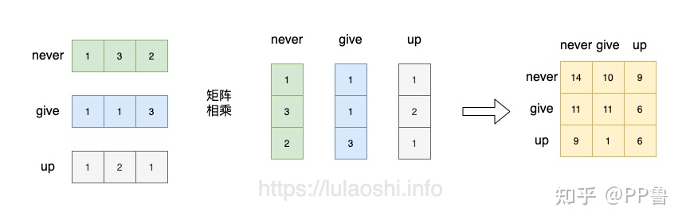
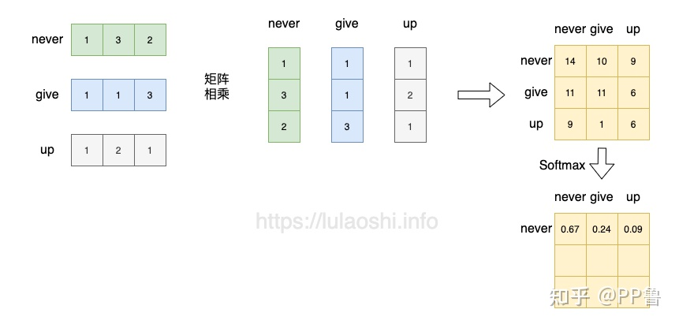
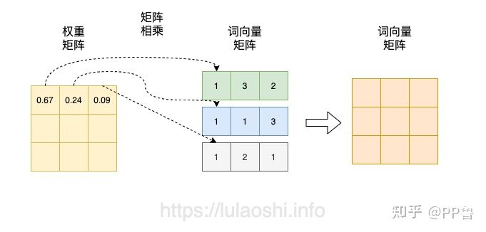
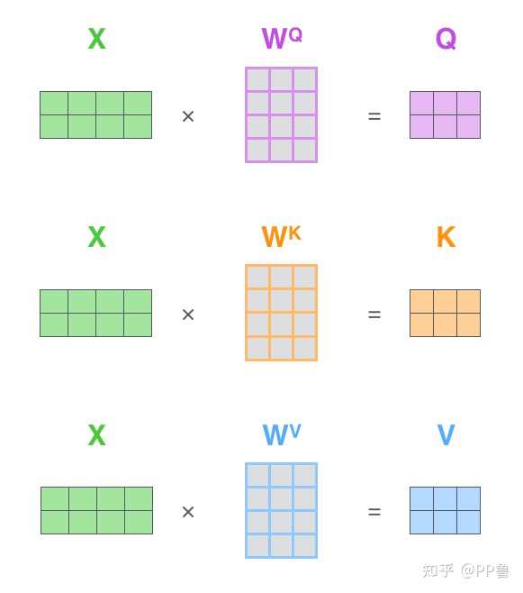
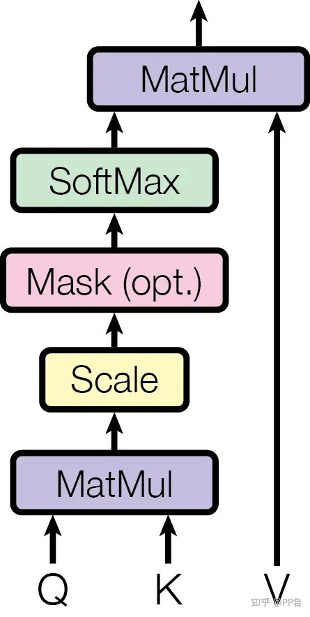
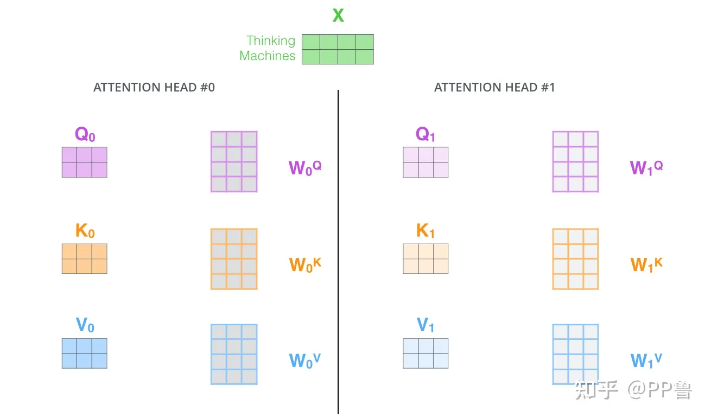
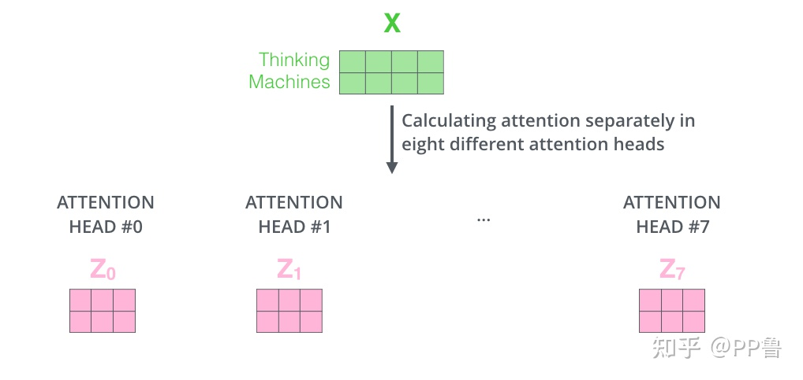
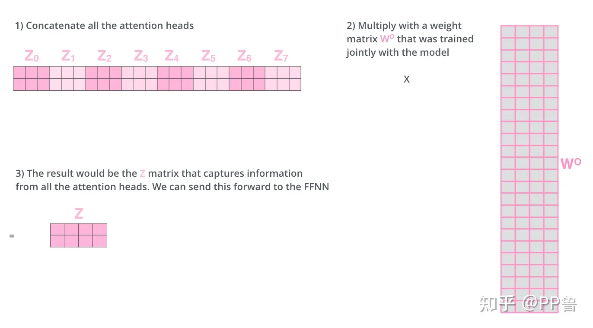
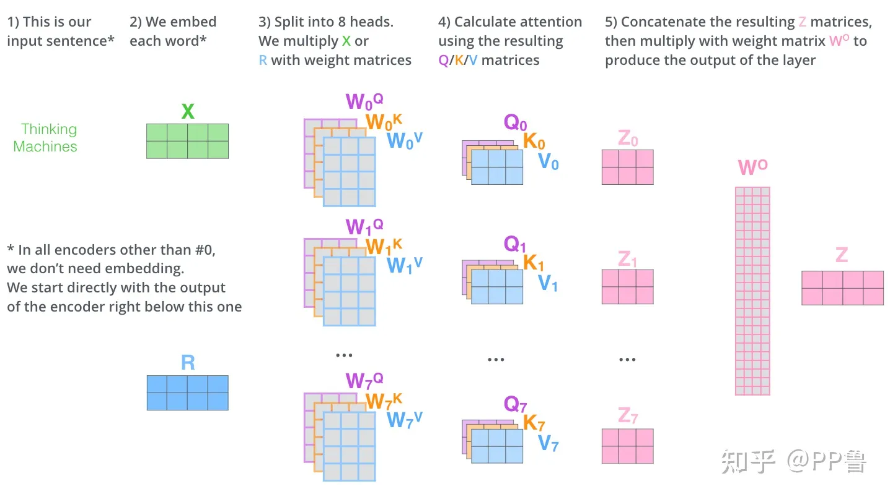
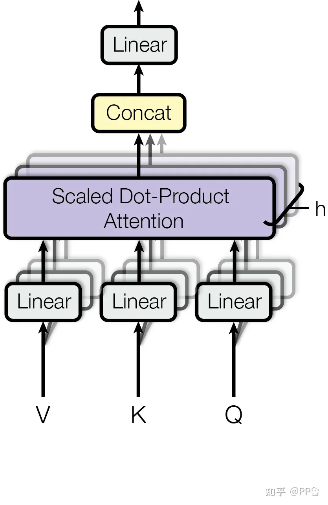

# 0. Basic
Website
-------
1. https://zhuanlan.zhihu.com/p/410776234
2. https://blog.csdn.net/qq_37541097/article/details/117691873

# 1. Attention

1. Attention 最核心的公式:
$\begin{cases}Attention(Q,K,V) = Softmax(\frac{QK^T}{\sqrt{d_k}})V \\
K:Key \\
Q:Query \\
V: Value
\end{cases}$
2. `向量点乘`的几何意义：向量 $x$ 在 $y$ 方向上的投影再与向量 $y$ 模长的乘积，能够反应`两个向量的相似度`
3. 下面以`词向量矩阵`为例，这个矩阵中，每行为一个词的`词向量`。

4. 紧接着做 $Softmax(XX^T)$. $Softmax$ 的作用是对`相似度矩阵`做归一化，得到了一个`归一化之后的权重矩阵`。(矩阵中，某个值的权重越大，表示相似度越高)

1. 在这个基础上，再进一步：$Softmax(XX^T)X$，将得到的`归一化的权重矩阵`与`词向量矩阵`相乘。权重矩阵中某一行分别与词向量的一列相乘，词向量矩阵的一列其实代表着不同词的某一维度。经过这样一个矩阵相乘，相当于一个`加权求和的过程`，得到结果词向量是经过`加权求和之后的新表示`。

Note
----
1. $Q$, $K$, $V$ 中的元素通常是小数，使用适当的随机分布随机初始化

## 1.1. `Q` (Quary), `K` (Key), `V` (Value)

1. `Attention 公式` $Softmax(\frac{QK^T}{\sqrt{d_k}})V$ 被描述为 `Scaled Dot-Production Attention`
2. `Q`、`K`、`V`其实都是从`同样的输入矩阵 X 线性变换`而来的。我们可以简单理解成：
$\begin{cases}
Q = XW^Q \\
K = XW^K \\
V = XW^V
\end{cases}$
2. 图片演示为：

3. $W^Q$, $W^K$, $W^V$ 是三个`可训练的参数矩阵`。输入矩阵 $X$ 分别与 $W^Q$, $W^K$, $W^V$ 相乘，得到 $Q$, $K$, $V$. `Attention` 不直接使用 $X$，而是使用经过矩阵乘法生成的这`三个矩阵`，`因为使用三个可训练的参数矩阵，可增强模型的拟合能力`。

4. 在这张图中，$Q$ 与 $K^T$ 经过 $MatMul$，生成了`相似度矩阵`。对相似度矩阵每个元素除以 $\sqrt{d_k}$，$d_k$ 为 $K$ 的维度大小。这个除法被称为 `Scale`。当很大时，$QK^T$ 的乘法结果方差变大，进行 `Scale` 可以使方差变小，训练时梯度更新更稳定。
5. `Mask` 是机器翻译等自然语言处理任务中经常使用的环节。在机器翻译等NLP场景中，每个样本句子的长短不同，对于句子结束之后的位置，无需参与相似度的计算，否则影响 $Softmax$ 的计算结果。

# 2. Multiple Head Attention

1. 为了`增强拟合性能`，Transformer 对 Attention 继续扩展，提出 `Multiple Head Attention`
2. $Q$, $K$, $V$ 是输入 $X$ 与 $W^Q$, $W^K$, $W^V$ 分别相乘得到的。
    - $W^Q$, $W^K$, $W^V$ 是`可训练的参数矩阵`
3. 现在对于输入 $X$，我们定义多组不同的 $W^Q$, $W^K$, $W^V$，比如 $W^Q_0$, $W^K_0$, $W^V_0$, $W^Q_1$, $W^K_1$, $W^V_1$。
4. 每组`分别`计算生成不同的 $Q$, $K$, $V$，最后`学习到不同的参数`。

4. 比如我们定义8组参数，同样的输入 $X$，将得到8个不同的输出 $Z_0$ 到 $Z_7$。

5. 在输出到下一层前，我们需要将8个输出拼接到一起，乘以矩阵$W^O$，将`维度降低回我们想要的维度`。

6. 多头注意力的计算过程如下图所示。

7. 再去观察Transformer论文中给出的多头注意力图示，似乎更容易理解了：

